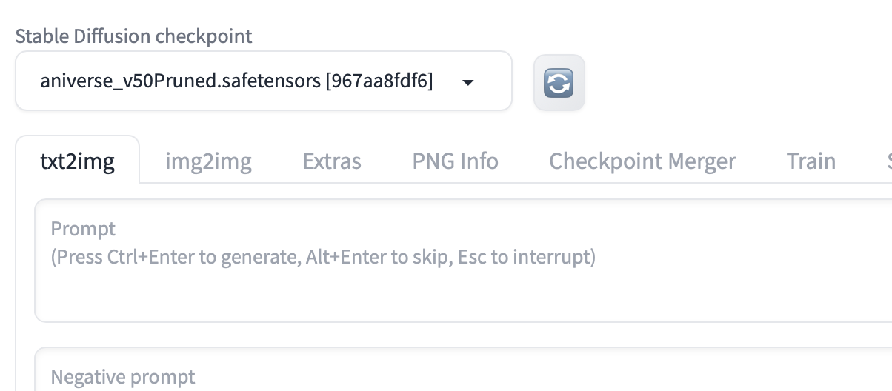
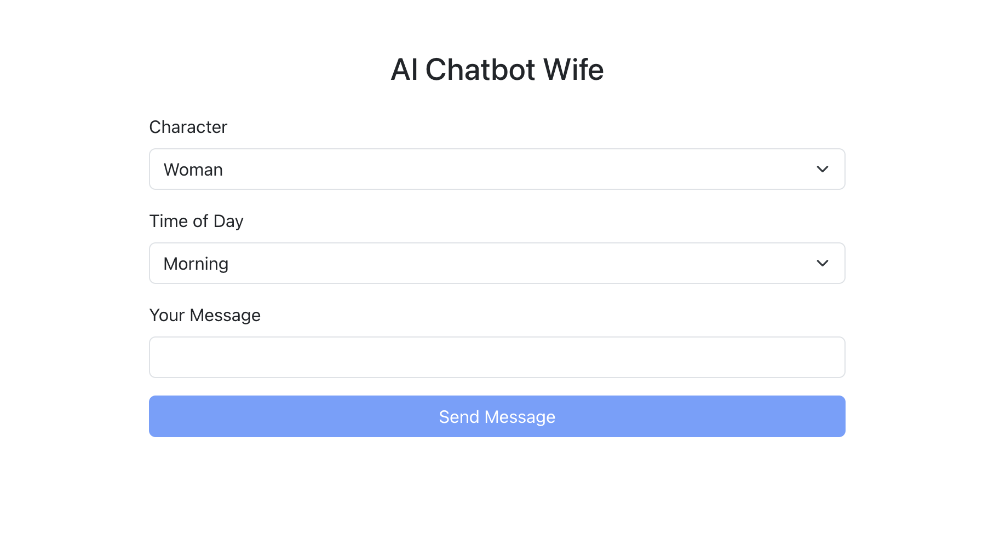
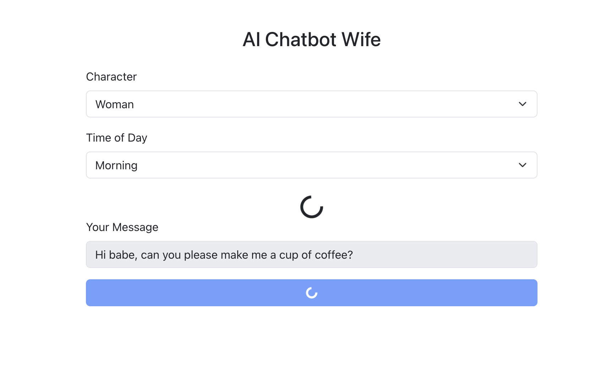

# Proof of Concept (POC) Documentation

## Overview

**Project Name**: AI Chatbot Wife  
**Description**: “This POC demonstrates an AI chatbot application where users can interact with an anime character that responds with text and images, simulating conversation scenarios based on the time of day.”

## Features

- **Feature 1**: User can choose character of AI chatbot like, woman, cat or dog character of woman.
- **Feature 2**: AI chatbot will respond with text message and image.
- **Feature 3**: It works with the history of the conversation while responding back.

## Technologies Used

- **Frontend**: React, Bootstrap
- **Backend**: Node.js
- **Image Generation**: FastAPI with Stable Diffusion
- **Other**: axios, openai

## Getting Started

### Prerequisites

List any prerequisites and how to install them. For example:

- Node.js and npm
- Python and pip (for FastAPI)

## Pre Requisite

Clone below Image model for Image generation in your local machine:

```bash
git clone https://github.com/AUTOMATIC1111/stable-diffusion-webui
```

Go to civitai.com(https://civitai.com)
Create your account and download Aniverse(https://civitai.com/models/107842/aniverse) Model for text2img generation.

Place downloaded model inside the stable-diffusion-webui project
Go to folder: models > Stable-diffusion
Put downloaded image model file inside Stable-diffusion.

Don't forget to select this downloaded model to select, check screenshot:


**Run it with below**

```bash
cd stable-diffusion-webui
./webui.sh --api
```

### Installation for AI Chat App

Provide step-by-step instructions to set up the project locally:

1.  **Clone the Repository**

    ```bash
    git clone https://github.com/amitchhatbar11/ai-chat-bot-wife.git
    ```

2.  **Navigate to the Project Directory**

    ```bash
    cd ai-chat-bot-wife
    ```

3.  **Install Backend Dependencies**

    ```bash
    cd backend
    npm install
    ```

4.  **Set Up Environment Variables**

    ```env
    OPENAI_API_KEY="add-your-open-ai-secret-key"

    NEGATIVE_PROMPT="nude, nudity, topless, naked, erotic, scary, half body, weird body structure, explicit, adult, , other people, strangers, crowds, angry, sad, stressed, clutter, dark lighting, harsh shadows, artificial lighting, heavy makeup, moles, (grayscale:1.4), extra limbs, extra hands, extra feet, extra fingers, bad anatomy, text, logos, watermarks, out of frame, 3D render, amputated hands, amputated fingers, deformed body, long neck, bad body proportions, mutated hands, mutilated, mutation, (ugly), morbid, disfigured, expose breasts, revealing clothes"

    POSITIVE_PROMPT="Wearing decent clothes always. (two hands, two legs, attention to detail about body structure, best quality, masterpiece, colorful, dynamic angle, highest detailed) upper body photo, perfect hands, flirting with POV, wearing decent clothes"

    STABLE_DIFFUSION_ENDPOINT="http://127.0.0.1:7860"
    ```

5.  **Install Frontend Dependencies**

    ```bash
    cd ../frontend
    npm install
    ```

6.  **Run the Backend**

    ```bash
    cd ../backend
    npm start
    ```

7.  **Open new tab & run the Frontend**

    ```bash
    cd ../frontend
    npm start
    ```






